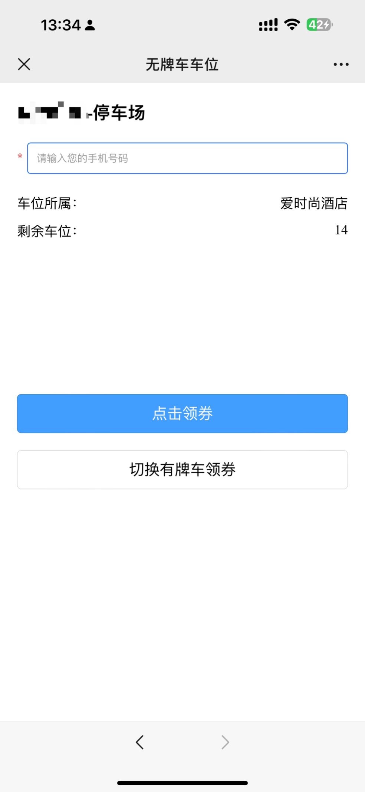

# 项目概述

该智慧停车场项目为前后端分离架构，本仓库为后端源码仓库，前端基于Vue3.0版本结合TypeScript，UI框架采用elementPlus，后端使用java进行编写，以Springboot 2.6.0 + mysql 8.0.3 + mybatis plus 3.5.2 + knife4j 3.0.3 + mapstruct 1.3.1.Final 作为核心框架进行开发。

mysql           数据库
knife4j         作为接口文档
mybatis plus    作为数据层
mapstruct       作为数据转换

前端仓库地址：git@github.com:OPENHEART-xiulian/web-smartparking-system.git

后端仓库地址：git@github.com:OPENHEART-xiulian/service-smartparking-system.git

可自行下载本地部署

本停车场软件是根据某车场定制化而来，包括对接各种硬件设备（一体机、闸机等）、车场车位配置（普通车、vip车、月保车等）、车场收费配置、月保收费配置、商家租赁车位配置、商家对账统计、优惠券领取、支付对接等等功能。简单好用，囊括车场经营管理常用功能，源码全部开放，欢迎自行接入调试，减少重复开发。
备注：如需技术服务或者定制化开发，可联系我司业务经理。

# 后端部署教程

部署文档存放在源码中，路径为：smartparking/src/main/resources/doc

脚本部署：

LINUX环境部署启动步骤：

1. 先项目使用maven自带的package命令打包成jar包。

2. 将jar包和 dt.sh 脚本放在服务器的同级目录中。

3. 执行命令 ./dt.sh start 启动项目。

注意事项:  

1. 如果在输入 ./dt.sh start 命令的时候，提示没有权限，那么就先使用root账号权限，在 dt.sh 脚本所在的目录中，输入：chmod u+x dt.sh 命令，给dt.sh脚本赋予可以执行的权限。   

2. dt.sh脚本所在的目录中，只能允许存在一个 以 .jar 为结尾的 包存在，如果存在多个 jar 文件，就会存在识别不出具体要启动哪个jar包。

dt.sh 脚本命令说明：
      
./dt.sh start     ---  启动    
./dt.sh stop      ---  停止     
./dt.sh restart   ---  重启

建议使用：./dt.sh restart 

命令查看运行日志命令：在jar包所在的目录中，输入：tail -f nohup.out

# 产品亮点

针对车场日常经营，本软件提供了商家租赁车位管理、商家车位营收对账、优惠券发放等功能，鼓励商家批量租赁车位，助力商家日常经营活动。比如一般商家免费停车2小时，酒店商家免费停车12小时等，增加消费者过来消费的动力。

# 版本说明

# 在线演示网址

https://smartparking.xlbzone.com/#/login

【后台管理登录账号】

登录账号：admin

密码：123456

【商家登录账号】

登录账号：hotel

密码：123456

如果您觉得此项目对你有帮助，请点亮 Star

# 功能演示图【商户端】

<table>
 <tr>
  <td>
    
    
  </td>
 </tr>
</table>

# 联系我们

